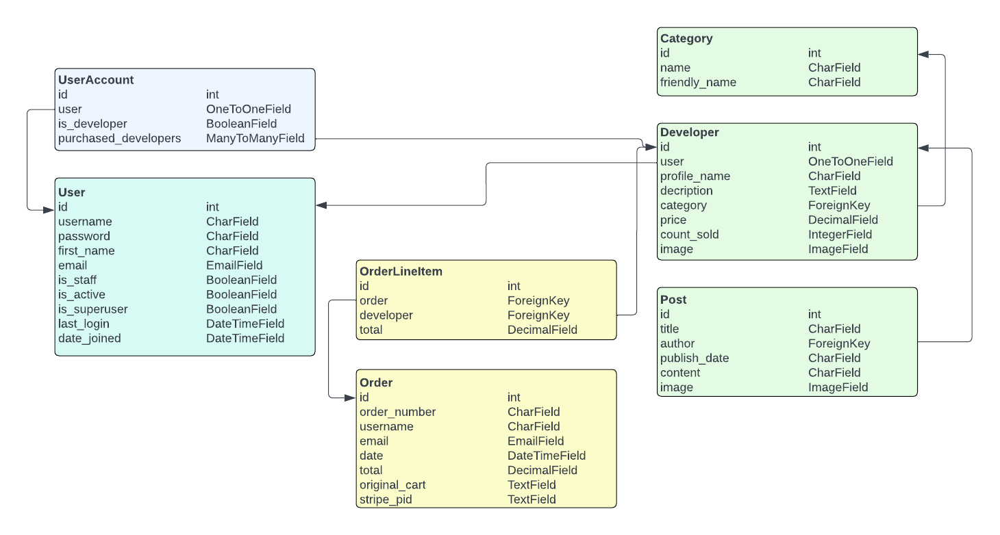

# supportDev (Membership creation platform, tailored to Developers)

**Developer: Adam Giles**

## Table of Content

- [Project Goals](#project-goals)
- [User Stories](#user-stories)
    - [Registration and User Accounts](#registration-and-user-accounts)
    - [Site Navigation and Views](#site-navigation-and-views)

## Project Goals
supportDev is a membership creation platform, tailored towards Developers. Developers create a Profile where they provide Supporters with access to exclusive content. This content could be; Developer Logs, Source Code, or links to products/apps. Developers set the access price for Supporters.

Supporters create an account to purchase access to Developer Profiles, as a way of supporting the Developer.

## User Stories
User stories have been separated into two groups; Developer and Supporter.

### Registration and User Accounts

- Developer
1. I want to be able to register for a Developer Profile. So that I can create a unique Profile for Supporters to purchase access to.
2. I want to be able to authenticate my registration via email confirmation. So that I can confirm my account registration was a success.
3. I want to be able to login to my Profile. So that I can access my Developer Profile.
4. I want to be able to logout of my Profile. So that I can protect my Profile from unauthorised access.
5. I want to be able to have a unique Developer Profile. So that I can provide Supporters with my exclusive content and save my payment details.

- Supporter
6. I want to be able to register for a Supporter Account. So that I can purchase access to Developer Profiles.
7. I want to be able to authenticate my registration via email confirmation. So that I can confirm my Account registration was a success.
8. I want to be able to login to my Account. So that I can purchase and access Developer Profiles.
9. I want to be able to logout of my Account. So that I can protect my Account from unauthorised access.
10. I want to be able to have a unique Supporter Account. So that I can view my Account details and purchased Developer Profiles.

### Site Navigation and Views 

- Developer 
11. I want to be able to view my Profile from both the perspective of a Developer and a Supporter. So that I can edit my Profile, and also check that the Supporter view meets my needs.
12. I want to be able to view data on my Supporters. So that I can use this information to tailor my Profile content if required.
13. I want to be able to easily create and edit my Profile content. So that I can provide content to my Subscribers.
14. I want to be able to amend my Profile details. So that I can ensure my details are correct and up to date.

- Supporter
16. I want to be able to view a list of Developer Profiles. So that I can choose which Profiles I would like to purchase access to.
17. I want to be able to view details of a Developer's Profile content. So that I can decide if the content is of interest to me.
18. I want to be able to amend my Account details. So that I can ensure my details are correct and up to date.
19. I want to be able to sort Developer Profiles by multiple criteria. So that I can quickly identify Developer profiles by price, category or post count.
20. I want to be able to view a list of Developer Profiles I have purchased access to. So that I can quickly navigate to a Developer's Profile.

### Structure

The website structure consists of the main "Base" page, with the following sections being added to this page dependant on the URL; Index Page, Explore Developers Page, Login Page, Register Page, Developer Profile/My Developer Profile Page, Create Developer Profile Page, Edit Developer Profile Page, Add a New Post Page, Edit Post Page, My Account Page, Shopping Cart Page, Checkout Page, Checkout Success Page, Contact Us Page, 404 Error Page and 500 Error Page.

The pages are detailed below;

Base Page

- This page contains a header; consisting of Site Logo and Navigation Bar (Links change if the user is logged in).

Index Page

- This page contains a Hero Section with sub-sections for "Support" and "Dev", each with text and a link. If the current user is not authenticated, the links navigate to the login page. If the user is authenticated, the "Support" section link, navigates to the "Explore Developers" page. The "Dev" section link navigates to the "Create Developer Profile" page, if the user has not already created a Profile. If they have created a Developer Profile, the link navigates to their Developer Profile page. 

Explore Developers Page

- This page contains a search bar, sort by filter,and a block for each Developer's Profile. Each block containes the Developer's Profile Image, Profile Name, Profile Description, Profile Price, Purchase Count and a link to the Developer's Full Profile.

Login Page

- This page contains a form for the user to complete that will log them into the site.

Register Page

- This page contains a form for the user to complete that will create an account on the site.

Developer Profile/My Developer Profile Page

- This page contains the selected Developer's Full Profile and Posts, each post block contains the Post Title, Post Content and Post Image. If the current user is viewing their own Developer Profile, links are available to edit the profile, add a new post and edit a post.

Create Developer Profile Page

- This page contains a form for the user to complete that will create a Developer Profile on the site.

Edit Developer Profile

- This page contains a form for the user to complete that will update their Developer Profile on the site.

Add a New Post Page

- This page contains a form for the user to complete that will create new post on their Developer Profile on the site.

Edit Post Page

- This page contains a form for the user to complete that will update a post on their Developer Profile on the site.

My Account Page

- This page contains the users details: Username, Email address and a link to change password. The page also contains a section displaying all the Developer Profiles the user has purchased access to.

Shopping Cart Page

- This page contains a list of items the user had added to their Cart, with the totals of each item and Cart Total. The user can then click a link to Checkout.

Checkout Page

- This page contains the Cart's contents along with a input for the user's card details. The user can then click a link to Complete the Purchase.

Checkout Success Page

- This page contains text to inform the user that the purchase was made.

CContact Us Page

- This page contains a contact form for the user to complete that will submit their message to the site admin.

404 Page

- A 404 page was created to ensure that a user can easily navigate back to the main site if they encounter a page which does not exist.

500 Page

- A 500 page was created to ensure that a user can easily navigate back to the main site if they encounter an internal server error.

### Code Structure
The website was built using Django Framework; separating the site into a number of apps.

The website apps are:
    - accounts (Based on the Boutique Ado project): This app contains the functionality around the user's account and purchased developers.
    - cart (Based on the Boutique Ado project): This app contains the functionality around the user's shopping cart.
    - checkout (Based on the Boutique Ado project): This app contains the functionality around the user's shopping cart checkout and payment.
    - contactus: This app contains the functionality around the Contact Us form, for user's to submit a message to the site admin database.
    - developer (Based on the Boutique Ado project): This app contains the functionality around the Developer pages.
    - home: This app contains the functionality around the home page.

Additionally there are:
    - support_dev: This contains the settings and main site config files.
    - templates: This contains the base.html and the django authentication allauth html templates.
    - static: This contains the css stylesheet.
    - manage.py This is the main file for starting the site.
    - README.md: This is the README documentation file
    - custom_storage.py: This is the boto3 configuration file for AWS
    - Procfile: This is to run the application
    -requirements.txt: This contains a list of the python libraries that are installed.

### Database

This is a data-centric website. Utilising html, css, js and bootstrap 5 for the front-end. With python, django framework and a Postgres database for the back-end.

### Physical Database Model

This model contains an overview of all the model fields, their types and connections. This reflects how the database is structured within the website.

### Models

The following models represent the database structure of the website:

##### UserAccount Model
The UserAccount model contains data for the user's account page.
 - Contains the following fields: user(OneToOneField), is_developer, purchased_developers(ManyToManyField).

##### Order Model
The Order model contains data on the orders.
 - Contains the following fields: order_number, username, email, date, total, original_cart, stripe_pid.

##### OrderLineItem Model
The OrderLineItem model contains data on the each entry in an order.
 - Contains the following fields: order(Foreign Key), developer(Foreign Key), lineitem_total.

##### ContactUs Model
The ContactUs model contains data on the message a user submits to the site admin.
 - Contains the following fields: user(Foreign Key), subject, body, sent_date.

##### Category Model
The Category model contains data on the categories a user can attach to their Developer Profile.
 - Contains the following fields: name, friendly_name.

##### Developer Model
The Developer model contains data on the user's Developer Profile.
 - Contains the following fields: user, profile_name, description, category(Foreign Key), price, count_sold, image.

##### Post Model
The Post model contains data on the user's Developer Profile Posts.
 - Contains the following fields: title, author(Foreign Key), publish_date, content, image.

## Technologies Used

### Languages

- HTML
- CSS
- Javascript
- Python
- Django

### Frameworks, Libraries & Tools

- [Am I Responsive](http://ami.responsivedesign.is/), used to create a devices mock-up image. 
- [Balsamiq](https://balsamiq.com/), used to create wireframes.
- [Bootstrap 5](httpshttps://getbootstrap.com/docs/5.2/getting-started/introduction/balsamiq.com/), used to style the website pages.
- [Favicon.io](https://favicon.io), used to create the site favicon.
- [Font Awesome](https://fontawesome.com/), used for all site icons.
- [Git](https://git-scm.com/), used for version control within VSCode to push the code to GitHub.
- [GitHub](https://github.com/), used to store project code.
- [Google Fonts](https://fonts.google.com/), used to acquire the site's font.
- [Lucidchart](http://lucidchart.com), used to create database design diagrams.
- [WC3 Validator](https://validator.w3.org/), [Jigsaw W3 Validator](https://jigsaw.w3.org/css-validator/), [Wave Validator](https://wave.webaim.org/), [Lighthouse](https://developers.google.com/web/tools/lighthouse/) and [Am I Responsive](http://ami.responsivedesign.is/), used to test the site's code, performance, accessibility and responsiveness. 

## Features

The website consists of fourteen pages with 18 features.

### Navigation Bar
- Situated in a persistent position at the top of every page.
- Contains links to the other website pages.
- Available links change if the user is logged into the website;
- Logged out: "Explore Developers", "Login" and "Register".
- Logged in: "Explore Developers", "My Developer Profile", "My Account", "Contact Us" and "Log out".
- When hovering over a link on Desktop devices the link colours change. This gives visible notification to the user that the link is clickable.
- Meets user stories: ???.

### Search Bar and Filter Bar
- Situated at the top of the Explore Developers page.
- User's can conduct keyword searches which will then only display Developer Profiles that contain the keyword.
- User's can order the displayed profiles by different criteria in ascending or descending order.
- Meets user stories: ???.

### Explore Developers Section
- Situated on the Explore Developers page.
- This section displays a "Developer block" for each submitted Developer Profile (Which Profiles show depends on any search criteria).
- Each "Developer block" contains the Developer's Profile Name, Category, Profile Image, Description, Purchase count and a line to view the full profile.
- Meets user stories: ???.

### Developer Profile Details Section
- Situated on the Developer Profile page.
- This page displays the selected Developer's Profile details.
- The same information as the Explore Developer Page is displayed in this section, but some content changes depending on if the user is logged in, has purchased the profile and if the Developer has added any posts.
- The Developer's Profile price and link to purchase only show if the Developer has added any posts. This is to ensure that there is content on the profile for the user to purchase.
- If the user is not logged in, the purchase link changes to a link to the login page
- If the current user is the owner of the Developer Profile, links are available on this section to edit the profile details.
- Meets user story: ???.

### Developer Posts Section
- Situated on the Developer Profile page.
- This page displays the selected Developer's Profile Posts.
- If the Developer has added any posts, they are displayed in "post blocks" here.
- Each block contains the Post Title, Published Date, Image and Content.
- The Post content is hidden and changes to a link to purchase if a user has not purchased this profile. 
- If the user is not logged in, the purchase link changes to a link to the login page
- If the current user is the owner of the Developer Profile, links are available on this section to add a new post and to edit a post.
- Meets user story: ???.

### Create a Developer Profile Section
- This page contains a form for the user to create a Developer Profile to the website.
- All field within the form are mandatory and must be completed.
- Validation exists to ensure the fields are completed and that the Price cannot be negative.
- The user then clicks a submit button, which adds the Developer Profile to the Developer database.
- Meets user story: ???.

### Edit Developer Profile Section
- This page contains a form for the user to edit their Developer Profile.
- All field are auto-populated with the current details.
- All field within the form are mandatory and must be completed.
- Validation exists to ensure the fields are completed and that the Price cannot be negative.
- This section contains a link to the delete profile page.
- The user then clicks a submit button, which updates the Developer Profile on the Developer database.
- Meets user story: ???.

### Delete Developer Profile Section
- This page contains text and a link asking if the user is sure they want to delete their profile.
- The user can confirm deletion, or return to the edit profile page.
- Meets user story: ???.

### Developer Posts Section
- Situated on the Developer Profile page.
- This page displays the selected Developer's Profile Posts.
- If the Developer has added any posts, they are displayed in "post blocks" here.
- Each block contains the Post Title, Published Date, Image and Content.
- The Post content is hidden and changes to a link to purchase if a user has not purchased this profile. 
- If the user is not logged in, the purchase link changes to a link to the login page
- If the current user is the owner of the Developer Profile, links are available on this section to add a new post and to edit a post.
- Meets user story: ???.

### Add a New Post Section
- This page contains a form for the user to add a new post to their Developer Profile.
- All field within the form are mandatory, except the image.
- Validation exists to ensure the mandatory fields are completed.
- The user then clicks a submit button, which adds the post to the Post database.
- Meets user story: ???.

### Edit Post Section
- This page contains a form for the user to edit their Developer Profile Post.
- All field are auto-populated with the current details.
- All field within the form are mandatory, except the image.
- Validation exists to ensure the mandatory fields are completed.
- This section contains a link to the delete post page.
- The user then clicks a submit button, which updates the post on the Post database.
- Meets user story: ???.

### Delete Post Section
- This page contains text and a link asking if the user is sure they want to delete their post.
- The user can confirm deletion, or return to the edit post page.
- Meets user story: ???.

### My Account Section
- This page displays the current users account details.
- Username, Email and a link to Change Password are presented to the user.
- A purchased developer section contains the details of any Developer Profiles the user has purchase with links to each profile.
- Meets user story: ???.

### Contact Us Section
- This page contains a form for the user to submit a message to the site admin.
- All field within the form are mandatory.
- Validation exists to ensure the mandatory fields are completed.
- The user then clicks a submit button, which adds the form to the contactus database.
- Meets user story: ???.

### Login Page
- This page contains a form for the user to log in to the website.
- This page is part of Django allauth.
- Meets user story: ??.

### Register Page
- This page contains a form for the user to create an account on the website.
- This page is part of Django allauth.
- Meets user story: ??.

### 404 Page
- This page is display when a user encounters a page that does not exist (HTTP 404 response code).
- The user is provided with a link to return to the index page.

### 500 Page
- This page is display when a user encounters an internal server error(HTTP 500 response code).
- The user is provided with a link to return to the index page.

### Responsive Design

Responsive Design

- The website is full responsive on desktop to mobile devices.
- Meets user story: ???.
